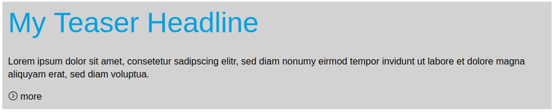
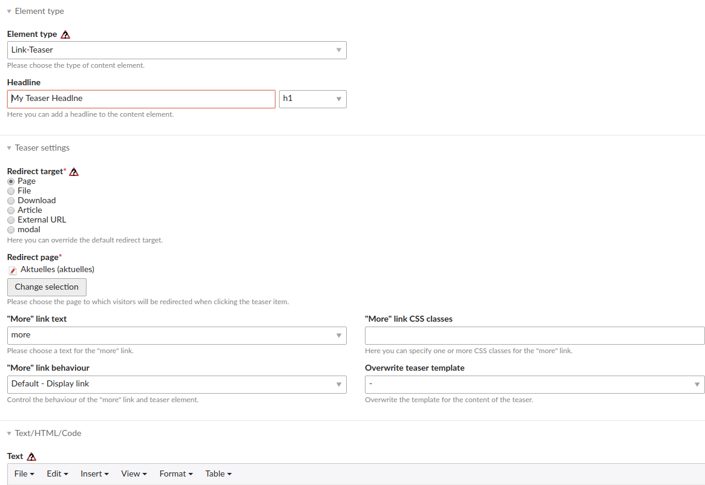

# Contao Teaser Bundle

Teaser is a contao content element, that provides the ability to link the element with pages, articles, files, downloads and external urls.
Can be used as replacement for ce_page_teaser. 

## Features
 
* Custom text and css-class for more link
* Link the whole article
* Hide more link, link entire element.
* Overwrite content template
* migration command from ce_page_teaser module and older versions.





## Usage

### Install
	
Prerequisites:
* Contao ^4.4 Managed edition
* PHP ^7.1

Install with composer:

```
composer require heimrichhannot/contao-teaser-bundle
```
Update the database afterwards.


## Developers

### Templates

* Element template prefix: `ce_linkteaser_`.
* Image template prefix: `linkteaser_content_image_`.

### Hooks

Name | Arguments | Expected return value | Description
---- | --------- | --------------------- | -----------
generateTeaserLink | $element: LinkTeaserElement, $showMore: bool | $showMore: bool | Add custom teaser source and modify the content element. 
getContentSourceOptions | $options: array, $dc: DataContainer | $options: array | Add custom source options to the dca.

### Commands

`huh:teaser:migrate` - Provide migration from ce_page_teaser moduel, contao-teaser module and version 0.x of this bundle.

### Add custom text for more link

Just add your custom text in the default contao translation file within `$GLOBALS['TL_LANG']['MSC']['linkteaser']['teaserlinktext']`. Afterwards (maybe you need to clear your cache) you can choose the new entry in the more link text field.

### Upgrade

#### From contao-ce_page_teaser module

* use migration command to update the database
* adapt template file

#### From module and version 0.x

* database articleId was dropped and article used instead (already existing in core)
* use migration command after update to get automatic migration